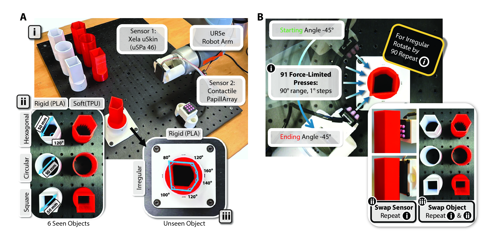
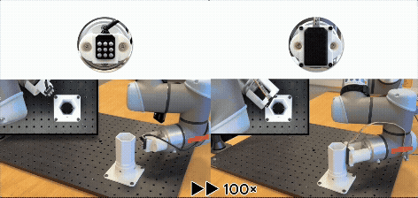

# UniTac-NV Dataset

This repository contains the code and documentation for the **UniTac-NV Dataset**, a unified tactile representation dataset for non-vision-based tactile sensors. This dataset was originally collected and used for the work presented in the IEEE IROS 2025 paper:


**[UniTac-NV: A Unified Tactile Representation For Non-Vision-Based Tactile Sensors](https://ieeexplore.ieee.org/abstract/document/11247617)**


## Dataset Overview

The UniTac-NV dataset focuses on aligning tactile data from different non-vision-based sensors (**Xela uSkin (uSPa 46)** and **Contactile PapillArray**) using Force/Torque (FT) sensor ground truth.

### Data Collection
The data was collected by pressing tactile sensors against 3D printed objects with specific geometries (square, circular, hexagonal and arbitrary prisms) and materials (PLA, TPU) using a UR5e robotic arm. Object CAD is available in folder `CAD`.

 

 A: Hardware setup for tactile contact data collection. B: Data collection procedure



Data Collection

*   **Video:** [[Link]](https://www.youtube.com/watch?v=KwVbppyKy80&t=1s)
*   **Details:** Refer to Section II of the [paper](https://ieeexplore.ieee.org/abstract/document/11247617) for the detailed experimental setup and collection procedure.


## Getting Started

### 1. Download the Dataset
1.  Download the dataset from this link: [[Link]](https://drive.google.com/file/d/10nlAYADVR--qq4IqebAIzC86yPu20R2W/view?usp=sharing)
2.  Unzip the downloaded file.
3.  Replace the folder named `UniTac-NV Dataset`.

### 2: Data Preprocessing
Run `0_data_preprocessing.py` to parse the raw CSV files into structured `.npz`files (`.csv` is available as well) and perform initial transformations (zeroing time, standardizing matrices, calculating angles).


### 3: Dataset Inspection (Optional)
Run `1_information.py` to generate a JSON summary of the processed data.


### Step 3: Data Alignment & Visualization
Open `2_data_alignment.ipynb` in and run the cells.

This notebook performs the alignment of the two different sensors (Xela and PapillArray) based on the FT sensor data.


## Citation
If you use this dataset in your research, please cite our paper:

```bibtex
@inproceedings{hou2025unitac,
  title={UniTac-NV: A Unified Tactile Representation For Non-Vision-Based Tactile Sensors},
  author={Hou, Jian and Zhou, Xin and Yang, Qihan and Spiers, Adam J},
  booktitle={2025 IEEE/RSJ International Conference on Intelligent Robots and Systems (IROS)},
  pages={17854--17860},
  year={2025},
  organization={IEEE}
}
